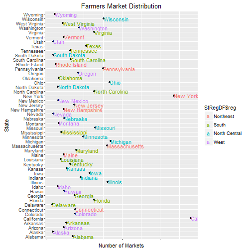

## The Farmers Market Find Application
* Application allows users to find Farmer's Markets in the United States
* Users can focus the map by
    + Pick a state from a drop down list
    + Pick a city from a drop down list
* Users can click the market circle to get details including its name, location, season of operation, and hours.

* Farmers Market - place where local farmers assemble to sell their goods directly to the public

---

## Data Handling
* Data from United States Government Data Catalog https://catalog.data.gov/dataset/farmers-markets-geographic-data
* Downloded the dataset https://apps.ams.usda.gov/FarmersMarketsExport/ExcelExport.aspx
* Removed rows with missing lattitude of longitude
* Trimmed white space
* City data in inconsistent - changed to uppercase
* Data set contains market demographics: MarketName, Address, Coordinates, Website, Other Media Handles
* Data set contains season and hours
* Data set contains products: Bakedgoods, Vegetables/Fruit, Cheese/Eggs,  Crafts, Flowers/Plants/Trees, Meat/Seafood, Other

---

## Farmers Market Distribution by State

---

## Next Steps

* Bugs
    + Browsers work inconsistently: Shiny app works in Firefox.  Does not work in IE.  Limited success in Chrome, Edge.
    + Allow the ability to go back to All States

* Enhancements
    + Allow user to specify product
    + Data for some markets suspect.  Not updated and season in in the past.  Exclude from app?

